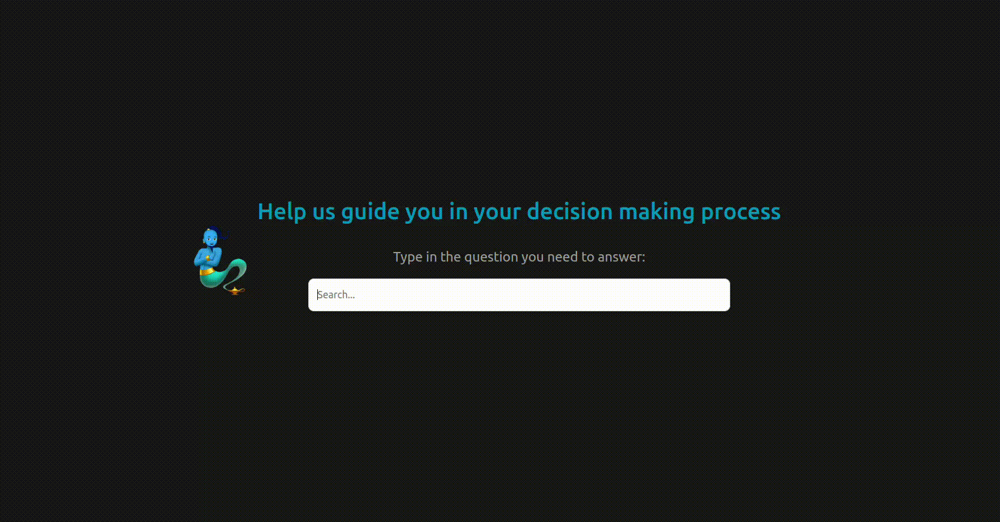
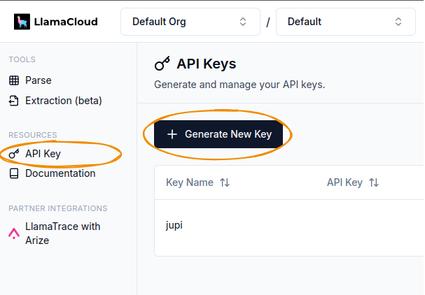
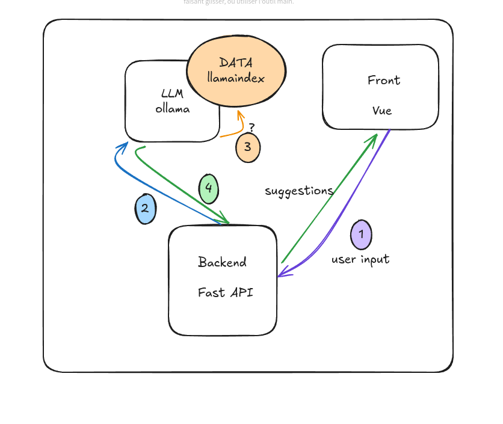

### Decision-Making Assistant


## Prerequisites:

### 1. LLama Cloud
- Sign up for a free [llama cloud](https://cloud.llamaindex.ai/) account
- Once signed in, go to `API-KEY --> Generate New Key`:


- Add the API key to a `.env` file at the root of this repository:

```bash
vim .env

# Add the API key like this:
LLAMA_CLOUD_API_KEY="llx-*****"
```

### 2. GPU Requirement
You will need a GPU to run the Llama3 model, which will be downloaded in the next step.

### 3. Docker Installation
You’ll need [Docker install](https://docs.docker.com/engine/install/) to run this application.\
Once Docker is set up, execute the installation script to create the Docker images, launch Docker Compose, and download the language model:

```bash
./install.sh
```

This step could take a while (~10min).

### 4. Running the Application
Once everything is set up, visit `localhost:8080` in your browser to access the app.


## About This App
This app assists users in formulating decision titles through a smart autocomplete feature.\
Think of it like a Google search bar for decision-making, where suggested titles help guide you.

Refer to the diagram below to understand the application architecture and workflow:


## User Stories:
1. As a user, I want to type part of a decision in the search bar and see relevant autocomplete suggestions to help me refine my decision title.
2. As a user, I want to click on a suggested title and be taken to a decision page displaying the selected title.
3. As a user, I want to set up the application easily with Docker, so I can run the backend and frontend with minimal effort.


## MVP Limitations and Next Steps
The goal of this exercise was to find an open-source LLM that:

- Supports easy data ingestion for context.
- Is fast enough for autocomplete use cases.
- Is simple to install and run on any machine.

While I explored several options, none fully met the needs within the given time.\
For instance, Arli AI had limitations in terms of input flexibility, data ingestion.\
On the other hand, running a model locally like Ollama offered much more option, but required a GPU.

Regarding speed performance, while I could speed up the response with the `streaming` option, I couldn't fully integrate it into the architecture (FastAPI + Vue). For now, the app runs at a slower pace, which can be improved in future iterations.

Additionally, this MVP lacks unit tests and error handling, but it provides a solid foundation to build upon.